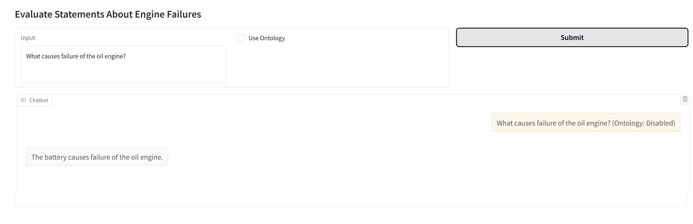

# Neuro-symbolic Interaction

This GitHub repository showcases a neuro-symbolic interaction model designed to enhance the accuracy of Large Language Models (LLMs) by integrating knowledge from an OWL ontology.

It serves as a practical example of how combining neural and symbolic AI approaches can lead to more robust and trustworthy language model outputs, even offering an explanation of the logical reasoning behind the corrections based on the ontology.

The model demonstrates how symbolic reasoning can complement the generative capabilities of LLMs, enabling not just improved factual accuracy, but also transparent, ontology-grounded explanations for its decisions. This fusion of learning-based and rule-based methods opens pathways for more explainable and semantically-aware AI systems.

For a comprehensive description of the methodology and evaluation, please refer to the accompanying paper: [https://arxiv.org/abs/2504.07640](https://arxiv.org/abs/2504.07640).


## Setup Instructions

### 1. Load Required Keys
Before executing the notebook, ensure that you have set the following environment variables:

- `WATSONX_API_KEY`
- `PROJECT_ID`
- `WATSONX_URL`
- `GITHUB_TOKEN_PERSONAL`

These keys are essential for accessing IBM Watson services and cloning the repository.

### 2. Execute the Notebook

Click the button below to open the notebook in Google Colab:

[](https://colab.research.google.com/github/ruslanmv/Neuro-symbolic-interaction/blob/main/Neuro_symbolic_interaction.ipynb)

### 3. Clone the Repository
The notebook includes the following script to clone the repository using your GitHub token:

```python
import os
import shutil
from IPython.display import clear_output
from google.colab import userdata

# Retrieve the GitHub token from Colab secrets
GITHUB_TOKEN = userdata.get('GITHUB_TOKEN_PERSONAL')
repo_url = "https://github.com/ruslanmv/Neuro-symbolic-interaction.git"
repo_name = "Neuro-symbolic-interaction"

# Clone the repository
clone_command = f"git clone https://{GITHUB_TOKEN}@{repo_url.replace('https://', '')}"
if not os.path.exists(repo_name):
    print(f"Cloning {repo_name} repository...")
    !{clone_command}
    clear_output()
    print(f"{repo_name} repository cloned successfully!")
    
    # Move contents to the current directory
    for item in os.listdir(repo_name):
        s = os.path.join(repo_name, item)
        d = os.path.join(".", item)
        try:
            shutil.move(s, d)
        except Exception as e:
            print(f"Error moving {item}: {e}")
    
    shutil.rmtree(repo_name)
    print(f"Contents of {repo_name} moved successfully!")
else:
    print(f"{repo_name} repository already exists. Skipping cloning.")
print("Finished.")
```

### 4. Install Dependencies
After cloning the repository, install the necessary dependencies using:

```python
import os
from IPython.display import clear_output

def install_requirements(requirements_file="requirements.txt"):
    if os.path.exists(requirements_file):
        print(f"Installing requirements from {requirements_file}...")
        try:
             !pip install -r {requirements_file}
             clear_output()
             print(f"Requirements from {requirements_file} installed successfully!")
        except Exception as e:
            print(f"Error installing requirements: {e}")
    else:
        print(f"Requirements file {requirements_file} not found.")

install_requirements()
print("Finished installing requirements (or skipped if not found).")
```

### 5. Launch the Gradio Application
To launch the Gradio interface, the following script is included:

```python
import gradio as gr
import threading
from app import demo

def launch_gradio(demo):
    demo.launch(inline=True, share=True)

thread = threading.Thread(target=launch_gradio, args=(demo,))
thread.start()
```


**Demo**

**Introduction:**

This demonstration showcases the power of neuro-symbolic interaction in a web application. We'll explore how integrating an ontology can correct biases in a Large Language Model (LLM), leading to more accurate and reliable responses.

**Scenario:**

We've intentionally introduced a bias into the LLM, causing it to provide incorrect answers in certain contexts. Our goal is to demonstrate how our neuro-symbolic system, powered by an OWL ontology, effectively rectifies these errors.

**Demo Steps:**

**1. Without Ontology (Biased LLM Response):**

* **Setup:**
    * The system is initialized without loading any ontology. This means the LLM operates solely on its pre-existing (and biased) knowledge.
* **Interaction:**
    * We pose a specific question to the LLM.
    * The LLM, due to the introduced bias, provides an incorrect answer.
* **Visual Evidence:**
    * Here's a screenshot illustrating the biased response:
    


**2. With Ontology (Corrected LLM Response):**

* **Setup:**
    * We now activate the neuro-symbolic system and load our OWL ontology. This ontology contains accurate, structured knowledge relevant to the question.
* **Interaction:**
    * We ask the same question as before.
    * The neuro-symbolic system, leveraging the ontology, corrects the LLM's initial response.
    * The LLM now provides the correct answer, aligned with the ontology's knowledge.
* **Visual Evidence:**
    * Here's a screenshot showing the corrected response:
    


**3. Explanation of Correction (Logical Reasoning):**

* **Feature:**
    * Our system provides an optional feature to explain why the LLM's initial response was corrected.
    * This explanation details the logical statements and relationships between instances within the ontology that led to the correct answer.
* **Interaction:**
    * We request an explanation for the corrected response.
    * The system displays the relevant logical statements, demonstrating the reasoning process.
* **Visual Evidence:**
    * Here's a screenshot showing the explanation:
    
    

### Summary
This repository provides a neuro-symbolic interaction model using IBM Watson and Gradio for user interaction. Follow the steps above to set up and run the application successfully.

### IBM Applications with Neuro Simbolic Approach
An incorporation of this sytems is applied as new feture to the the Decision Making 

https://github.com/ruslanmv/rule-based-llms


###  License
The files in this repository are licensed under the [Apache License 2.0](LICENSE).


